<p align="center">
  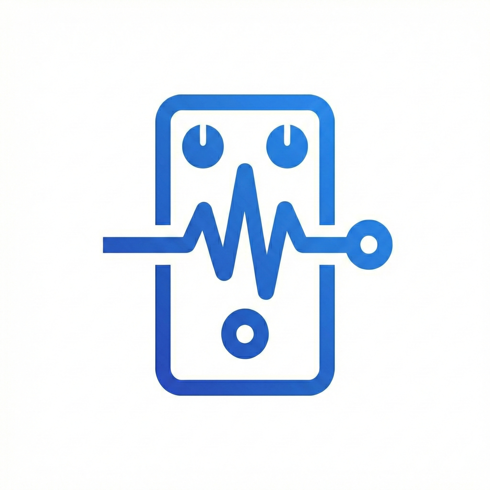
</p>

<h1 align="center">RiffNode</h1>

<p align="center">
  <strong>A visual guitar effects playground for iPad and Mac.</strong><br>
  Build a pedalboard, see your sound, and control it hands-free – all on device, all offline.
</p>

<p align="center">
  <a href="#try-it-in-3-minutes">Try it</a> ·
  <a href="#why-riffnode">Why RiffNode</a> ·
  <a href="#the-riff-notch">Riff Notch</a> ·
  <a href="#features">Features</a> ·
  <a href="#architecture">Architecture</a> ·
  <a href="#swift-student-challenge-2026">Swift Student Challenge</a>
</p>

<p align="center">
  
  
  
  
  <a href="LICENSE"></a>
</p>

<p align="center">
  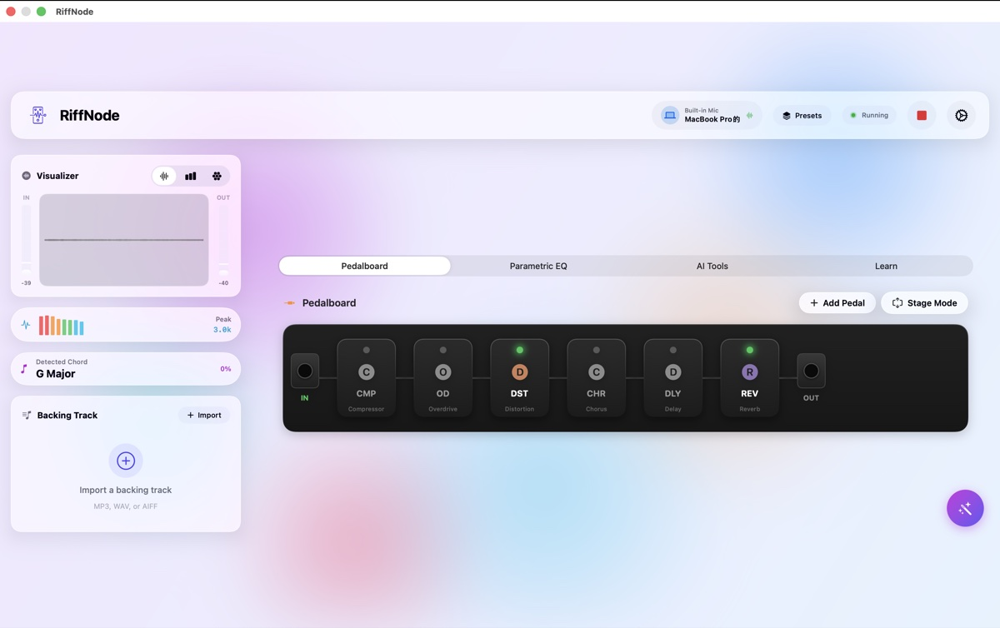
</p>

Guitar effects are usually explained with jargon and sold as expensive boxes. RiffNode turns them into something you can **see, touch and hear** in a few minutes: drag pedals into a signal chain, watch the waveform and spectrum change as you play, ask the on-device AI for a tone in plain English, and switch presets with a nod of your head while both hands stay on the guitar.

## Why RiffNode

- **No guitar? Still playable.** A built-in demo riff is synthesized on device and fed into the chain exactly where a guitar would enter, so anyone can hear what each pedal does.
- **See the sound.** A live waveform, a 32-band spectrum, IN/OUT meters and a tuner react to every note.
- **Hands-free control.** Vision face tracking turns head nods, tilts and an open mouth into preset changes, bypass and a wah-style expression pedal.
- **Describe the tone, get the tone.** Foundation Models translates "warm jazz clean" or "heavy metal riff" into real effect parameters, entirely on device – and shows each step live as it picks pedals and dials in settings.
- **Learn by listening.** Every effect in the guide has a **Hear it** button: the demo riff plays through that pedal alone, with an A/B switch against the dry sound.
- **Private and offline.** No account, no network, no analytics. Audio, camera frames and AI prompts never leave the device.

## Try it in 3 minutes

| Step | What to do | What you'll see |
| --- | --- | --- |
| 1 | Tap **Get Started** and allow the microphone | The audio engine starts and the Riff Notch turns green |
| 2 | Tap **Take the Tour** (or skip it) | A short walkthrough of the signal chain |
| 3 | Tap **No guitar? Try the Demo Riff** (`⌘D`) | A riff plays through your pedals; the visualizer, spectrum and chord detector come alive |
| 4 | Tap a pedal, or double-tap to bypass it | The sound and the spectrum change instantly; the notch announces the change |
| 5 | Open the **Tone Assistant** (`⌘J`) and tap *Ambient pad* | Watch it pick pedals and settings step by step, then rebuild the chain |
| 6 | Turn on **Gesture Control** and nod | Presets switch hands-free, with feedback in the notch |

> [!TIP]
> Plug a guitar into any USB audio interface to play through the same chain live. The built-in microphone also works for quick tests.

## The Riff Notch

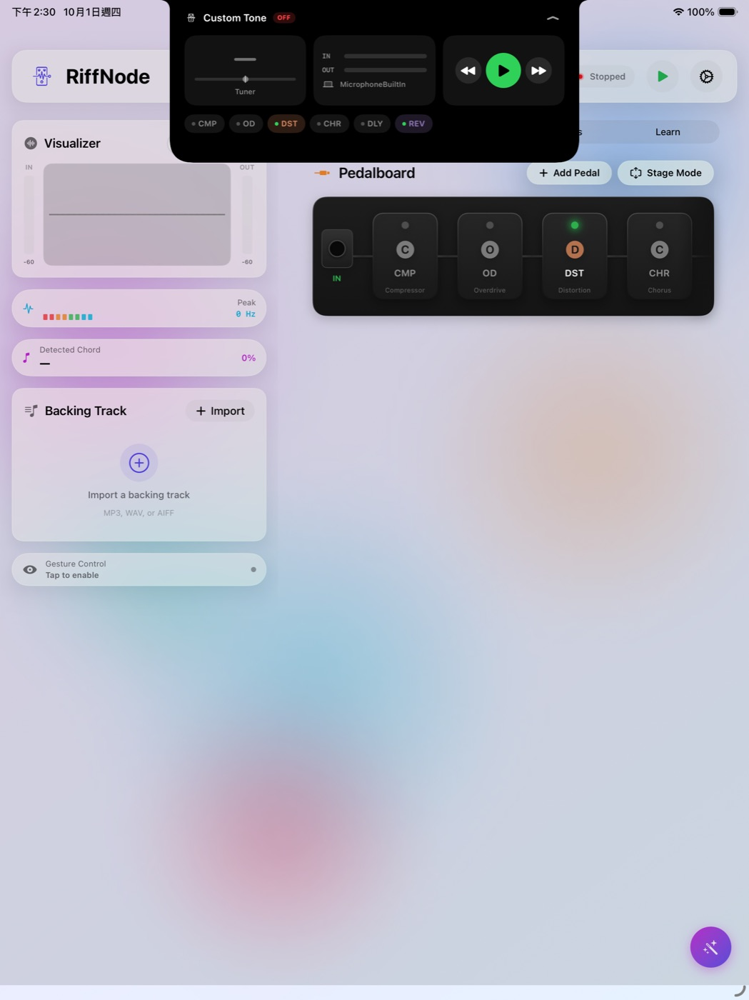

A Dynamic Island–style notch hangs from the top of the window on both iPad and Mac. It gives you feedback while your eyes are on the fretboard – especially important for head gestures, which otherwise have no visual response.

| State | Shows |
| --- | --- |
| **Closed** | Engine LED, live input level, the note you're playing (green when in tune) |
| **Popping** | A short banner when a preset, pedal, gesture or engine state changes |
| **Opened** | Tuner, IN/OUT meters, start/stop, previous/next preset and tap-to-toggle pedal chips |

Tap it or press `⌘K` to open it. Its shape, states and spring animation are inspired by [NotchDrop](https://github.com/Lakr233/NotchDrop), rebuilt as a single animatable SwiftUI `Shape` so it works inside an App Playground on iPad and Mac Catalyst.

<br clear="right">

## Features

### Real-time effects

11 effect types, built on `AVAudioEngine`. Every pedal stays wired in chain order, so switching one on or off is an instant bypass. AVFoundation has no modulation effects, so Chorus, Flanger, Phaser and Tremolo run in a custom in-process **Audio Unit** with real LFO-driven DSP.

| Category | Effects |
| --- | --- |
| Dynamics | Compressor |
| Filter & Pitch | Parametric EQ (10 bands, draggable curve, 14 presets) |
| Gain / Dirt | Overdrive · Distortion · Fuzz |
| Modulation | Chorus · Phaser · Flanger · Tremolo |
| Time & Ambience | Delay · Reverb |

**14 built-in presets** across Clean, Crunch, Heavy and Ambient – from *Slapback Echo* to *Djent Machine* and *Shoegaze*. **Stage Mode** turns the pedalboard into a full-screen performance view with large footswitches.

### Hands-free Vision control

| Gesture | Default action |
| --- | --- |
| Nod down / up | Next / previous preset |
| Tilt left / right | Bypass all / enable all |
| Open mouth | Wah-style expression control |
| Raise eyebrows | Toggle compressor |

### On-device AI

- **Tone Assistant** – chat in plain English; Foundation Models returns structured settings with `@Generable` and applies them to the pedalboard. Output is streamed, so the chat shows what the model is doing ("Picking pedals: Distortion · Reverb", "Setting reverb decay → 5").
- **Honest fallback** – RiffNode checks `SystemLanguageModel.availability`. Without Apple Intelligence an offline tone matcher answers instead, and every reply is labelled with which one responded.
- **Chord → tone suggestions** – when a chord is held steadily, RiffNode suggests a matching tone you can apply in one tap.
- **Analysis** – FFT spectrum (Accelerate / vDSP) and autocorrelation pitch detection power the tuner and chord detector. The live spectrum is drawn behind the Parametric EQ curve, so you can see which frequencies you are shaping.

### Keyboard shortcuts (Mac and iPad)

| Shortcut | Action |
| --- | --- |
| `⌘↩` | Start / stop the engine |
| `⌘D` | Play / stop the demo riff |
| `⌘←` `⌘→` | Previous / next preset |
| `⌘K` | Open / close the Riff Notch |
| `⌘J` | Open / close the Tone Assistant |
| `⌘1` – `⌘4` | Pedalboard · Parametric EQ · AI Tools · Learn |

## Gallery

<table>
  <tr>
    <td width="50%">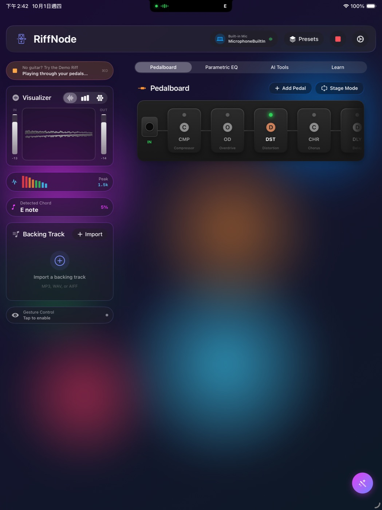<br><sub><b>Dark mode on iPad</b> – the demo riff driving the visualizer and chord detector</sub></td>
    <td width="50%">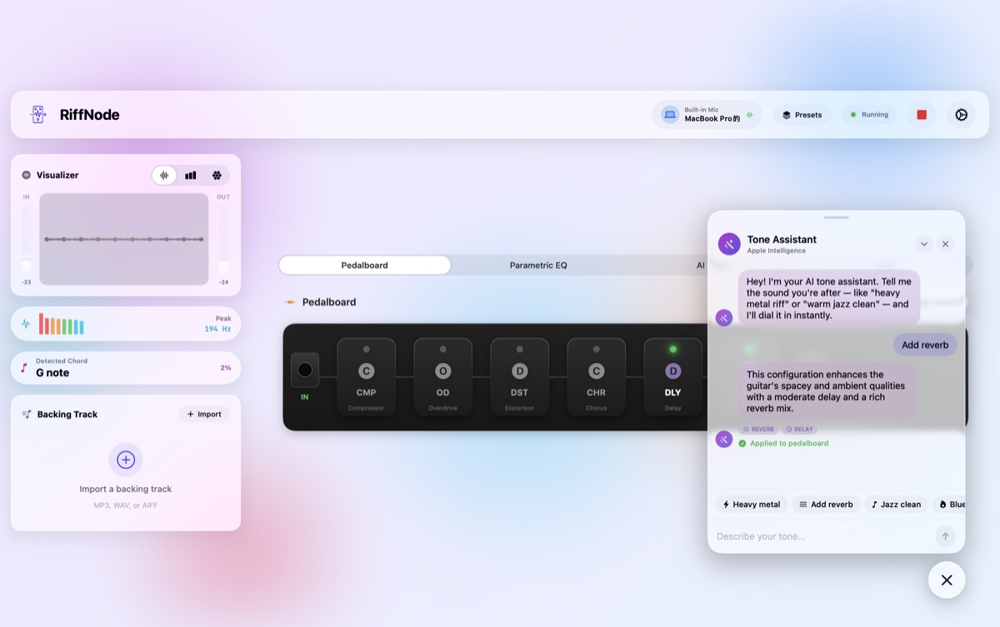<br><sub><b>Tone Assistant</b> – describe a sound, get a pedalboard</sub></td>
  </tr>
  <tr>
    <td>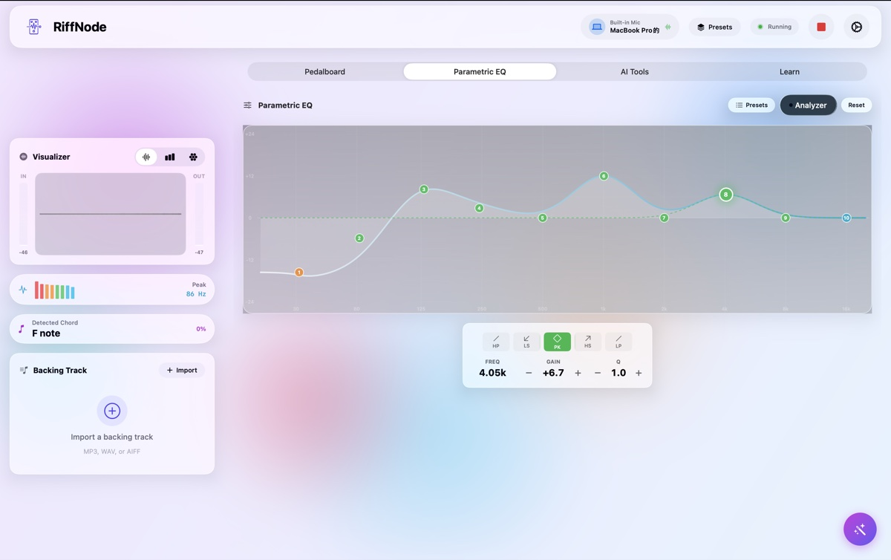<br><sub><b>Parametric EQ</b> – ten draggable bands over a live analyzer</sub></td>
    <td>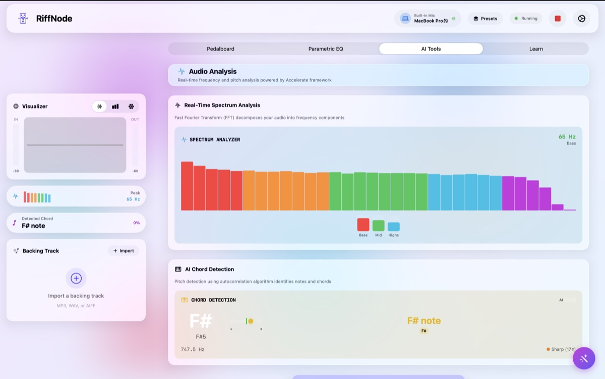<br><sub><b>Audio analysis</b> – FFT spectrum and chord detection</sub></td>
  </tr>
  <tr>
    <td>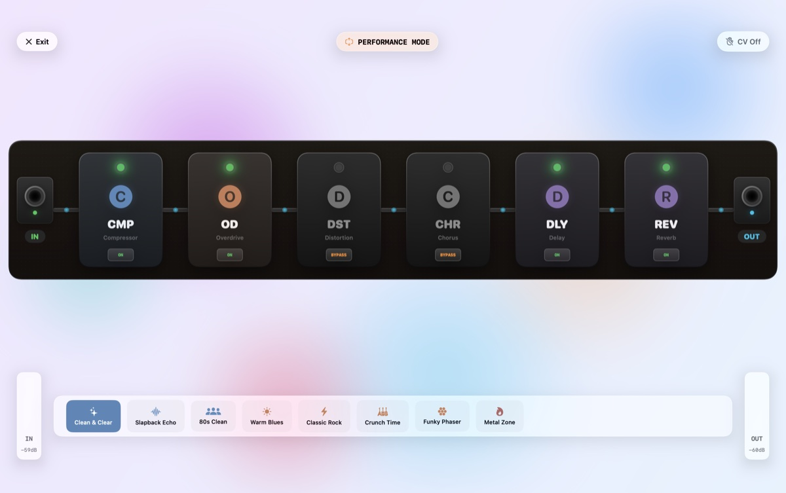<br><sub><b>Stage Mode</b> – big footswitches and a quick preset bar</sub></td>
    <td>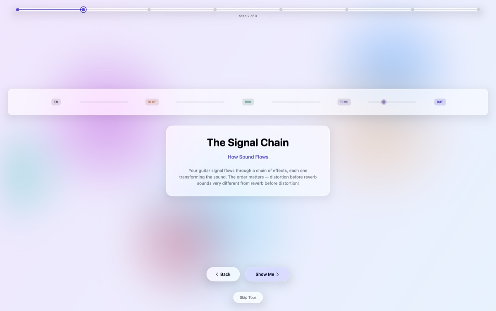<br><sub><b>Guided tour</b> – how sound flows through a chain</sub></td>
  </tr>
  <tr>
    <td>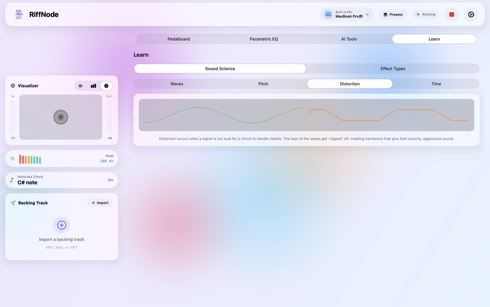<br><sub><b>Sound science</b> – see why distortion sounds the way it does</sub></td>
    <td>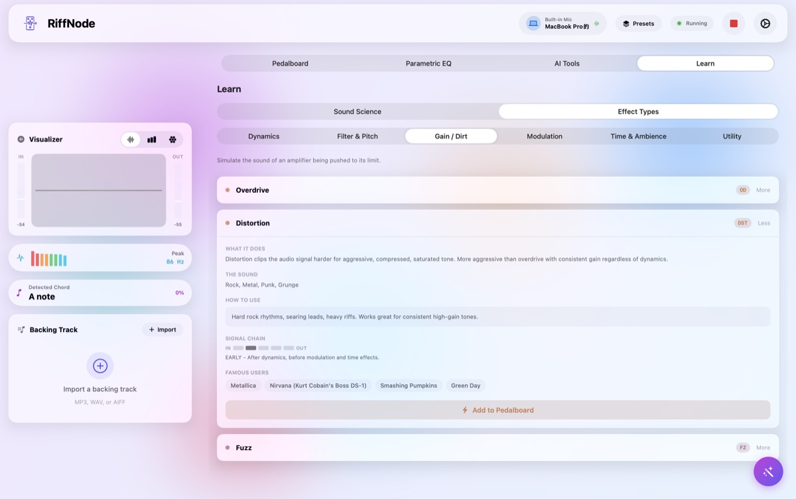<br><sub><b>Effect guide</b> – what it does, where it goes, who used it</sub></td>
  </tr>
</table>

## Technical stack

| Component | Technology | How it's used |
| --- | --- | --- |
| Language | Swift 6 | Strict concurrency checking, `Sendable` audio data |
| UI | SwiftUI · Liquid Glass | `glassEffect`, `GlassEffectContainer`, `Canvas` visualizers at 30–60 fps |
| Audio | AVFoundation | `AVAudioEngine`, `AVAudioUnit` effects, input taps, player nodes |
| DSP | Accelerate (vDSP) | FFT spectrum, autocorrelation pitch detection |
| Vision | Vision | `VNDetectFaceLandmarksRequest` for head and face gestures |
| AI | Foundation Models | On-device `LanguageModelSession` with `@Generable` tone parameters |
| State | Observation | `@Observable` view models and services |

### Implementation notes

- **Swift 6 audio taps** – tap blocks are global, non-isolated functions writing into a lock-protected buffer, so no `@MainActor` closure ever runs on the audio thread.
- **Responsive start-up** – `AVAudioSession` activation runs off the main thread.
- **Demo riff** – Karplus–Strong plucked-string synthesis with a seeded generator renders the same original power-chord riff on every run, with no bundled audio files.
- **Real-time modulation DSP** – a custom `AUAudioUnit` processes in place on the audio thread with no allocation or locks; parameters cross threads through `Synchronization.Atomic`.
- **Fast on-device AI** – a compact `@Generable` schema (up to five pedals, three settings each) and a fresh, prewarmed session per request keep responses to a few seconds and never overflow the 4K context window.

## Architecture

RiffNode follows **MVVM** inside a **Clean Architecture** layout: views render state, view models own feature logic, and services sit behind protocols.

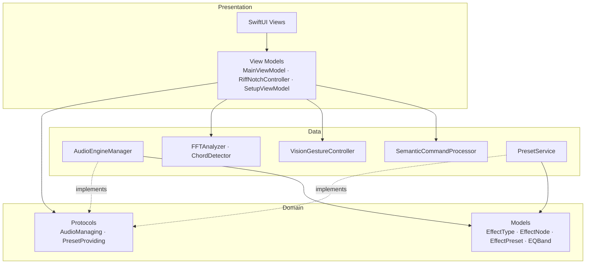

```
RiffNode.swiftpm/
├── App/                    Entry point and root router (Welcome → Tour → Main)
├── Domain/
│   ├── Models/             Effect, preset, EQ and analysis models
│   └── Protocols/          AudioManaging, EffectsChainManaging, PresetProviding …
├── Data/
│   ├── Audio/              AudioEngineManager, DemoRiffSynthesizer, DSP/ModulationAudioUnit
│   ├── Analysis/           FFTAnalyzer, ChordDetector
│   ├── Vision/             VisionGestureController
│   ├── AI/                 SemanticCommandProcessor
│   └── Presets/ · Learning/
├── Presentation/
│   ├── ViewModels/         MainViewModel, RiffNotchController, SetupViewModel …
│   ├── Views/              One folder per feature: Main, Notch, Pedalboard, EQ, AI, Learn …
│   └── DesignSystem/       Spacing and color tokens, glass components, NotchShape
└── Core/Extensions/
```

- **Single responsibility** – each view model owns one feature (`MainViewModel`, `EffectsChainViewModel`, `BackingTrackViewModel`…).
- **Dependency inversion** – views and view models depend on protocols such as `AudioManaging`, not on concrete engines.
- **Isolated infrastructure** – audio, vision and AI live in their own services and communicate through observable state.

## Getting started

### Requirements

- iPadOS 26 or macOS 26 (Apple silicon)
- Swift Playgrounds on iPad or Mac, or Xcode 26+
- Optional: a guitar and USB audio interface, and a front camera for gestures

### Run

```bash
git clone https://github.com/RiffNode/riffnode-wwdc2026.git
open riffnode-wwdc2026/RiffNode.swiftpm
```

Open `RiffNode.swiftpm` in Swift Playgrounds or Xcode and run it on iPad or **My Mac**. The demo riff works in the iPad simulator; live guitar input and gestures need a real device.

## Swift Student Challenge 2026

RiffNode was built for the **Apple Swift Student Challenge 2026** as an App Playground. It is designed for the challenge's format:

- Runs **fully offline** – no network calls, no downloaded models or assets.
- Delivers the core experience in **under three minutes**, with or without a guitar.
- Ships as a single `.swiftpm` with no third-party dependencies.

It brings low-level signal processing, computer vision and on-device AI together to make music technology something you can explore, not just read about.

## Acknowledgements

- [NotchDrop](https://github.com/Lakr233/NotchDrop) by Lakr Aream (MIT) – inspiration for the notch shape, its states and its spring animation.
- Effect history and signal-chain guidance draw on common guitar-gear knowledge, written for this project.

## License

RiffNode is released under the [MIT License](LICENSE).

<p align="center">
  Made with ❤️ and a lot of feedback loops by Jesse
</p>
